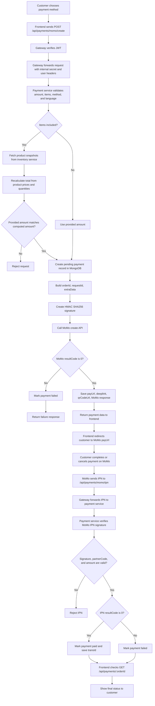
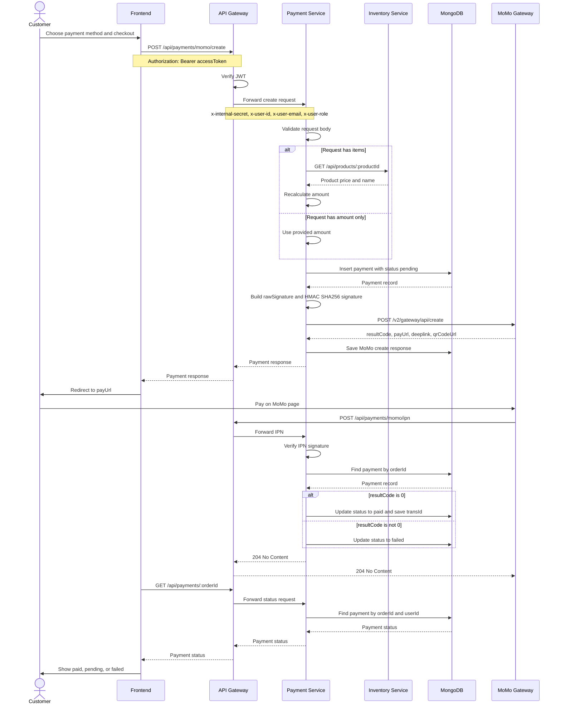
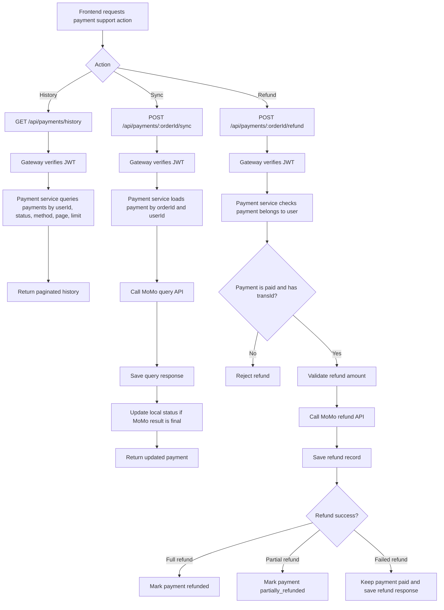

# Payment Service Diagrams

This document explains how the `paymentServices` module works with MoMo through the API gateway.

## Main Endpoints

The frontend should call the gateway endpoints, not the payment service directly.

| Action | Gateway endpoint | Purpose |
| --- | --- | --- |
| List payment methods | `GET /api/payments/methods` | Returns supported MoMo methods. |
| Create payment | `POST /api/payments/momo/create` | Creates a payment record and returns MoMo `payUrl`. |
| Receive MoMo IPN | `POST /api/payments/momo/ipn` | MoMo calls this after payment result is known. |
| View payment history | `GET /api/payments/history` | Returns authenticated user's payment history. |
| View one payment | `GET /api/payments/:orderId` | Returns one authenticated user's payment status. |
| Sync from MoMo | `POST /api/payments/:orderId/sync` | Queries MoMo and updates local payment status. |
| Refund payment | `POST /api/payments/:orderId/refund` | Sends refund request to MoMo and updates refund state. |

## Payment Methods

| `paymentMethod` | MoMo `requestType` | Description |
| --- | --- | --- |
| `wallet` | `captureWallet` | Pay with MoMo E-Wallet. |
| `atm` | `payWithATM` | Pay with domestic ATM card. |
| `credit_card` | `payWithCC` | Pay with credit card. |
| `momo_methods` | `payWithMethod` | MoMo hosted page lets user choose a method. |

## Activity Diagram

## Sequence Diagram

## History, Sync, And Refund Flow

